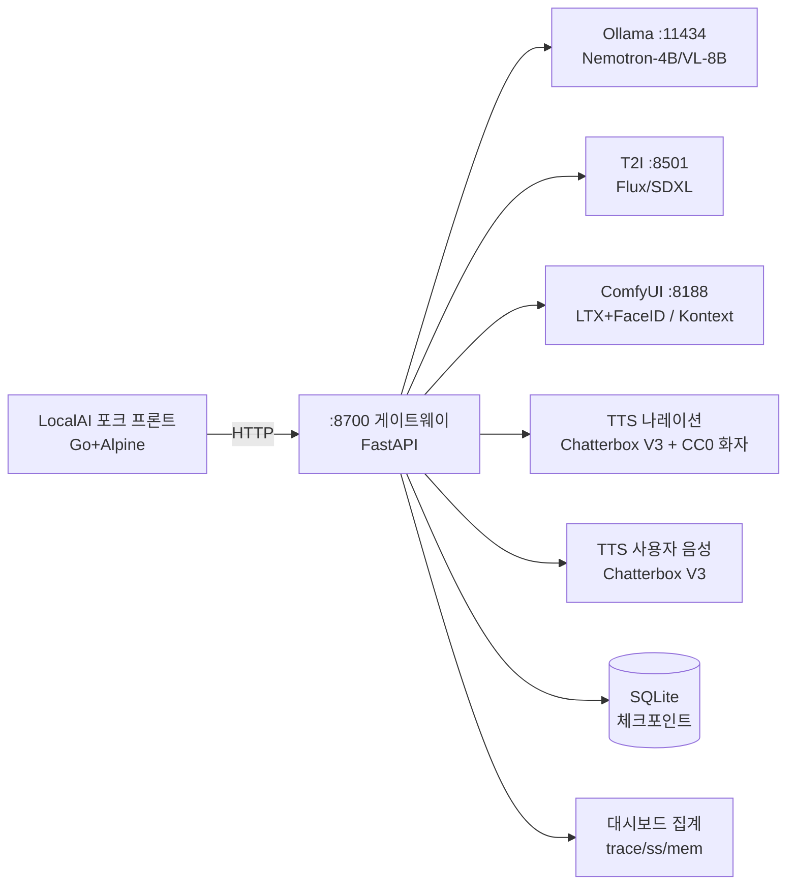
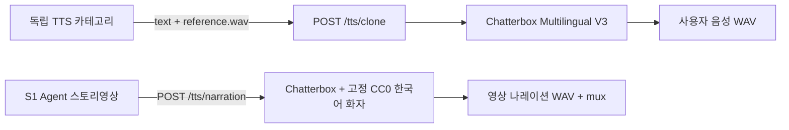
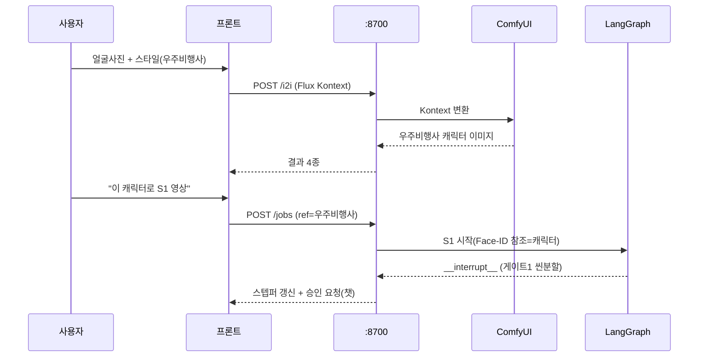
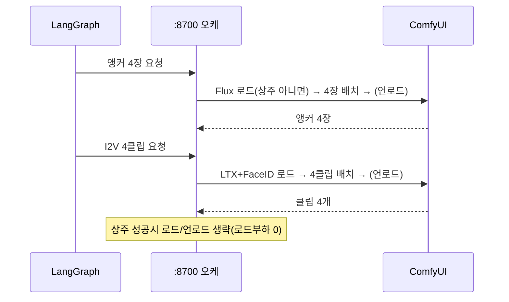

# Architecture — 오픈셸 자립형 생성 스튜디오

작성일: 2026-07-28
기준 문서: docs/PRD.md

## 기술 스택

| 레이어 | 선택 | 근거 |
|--------|------|------|
| UI 프론트 | LocalAI 포크 (Go 템플릿 + Alpine.js) | 룩앤필과 카테고리를 기본 제공하므로 UI 외형만 재사용 |
| 게이트웨이 | :8700 FastAPI (기존 LangGraph API 확장) | 라우팅과 OOM 오케스트레이션, 대시보드 집계를 한곳에서 총괄 |
| 에이전트 | LangGraph + SQLite 체크포인터 | 승인 3게이트(interrupt), thread_id=job_id 재개 |
| LLM 서빙 | Ollama (:11434) | Nemotron-4B는 기동 시 워밍업 후 상주, 비전 모델은 배치 언로드 |
| 이미지 | Flux.1/SDXL(:8501) · Flux Kontext(ComfyUI :8188) | T2I 앵커 / I2I 얼굴변환 |
| 영상 | ComfyUI(:8188): LTX distilled+Face-ID / Cosmos 벤치마크 (Wan 제거, Task 6.5) | 캐릭터와 화풍이 일관된 I2V, T2V |
| 영상 나레이션 TTS | Chatterbox Multilingual V3 | S1 전용 고정 CC0 한국어 화자 |
| 사용자 음성 TTS | Chatterbox Multilingual V3 | 독립 TTS 전용, 한국어 zero-shot clone, GPU 약 3.0GiB 실측 |
| 저장 | SQLite(체크포인트) · 파일시스템(mp4/이미지) | 단일 사용자, 로컬 전용 |
| 배포 | systemd user units | 기존 관례(wan/comfyui/anim-agent), 격리·재기동 |

## 컴포넌트 경계

| 컴포넌트 | 책임 (한 줄) | 의존 대상 |
|----------|-------------|----------|
| LocalAI 포크 프론트 | 카테고리·스타일 셀렉터·노드 스텝퍼·대시보드 렌더, :8700만 호출 | :8700 |
| :8700 게이트웨이 | 요청 라우팅, OOM 배치 오케스트레이션, 대시보드 메타 집계, 승인 게이트 중계 | 전 백엔드 |
| LangGraph 에이전트 | S1 파이프 상태머신, 승인 3게이트, 재개 | Ollama·:8501·:8188·Chatterbox·SQLite |
| Ollama | 씬분할(텍스트)과 캡션(비전) 담당 | 모델 GGUF |
| T2I(:8501) | 앵커/단발 이미지 | Flux/SDXL 가중치 |
| ComfyUI(:8188) | I2V(캐릭터 일관 + T2V/폴백) + I2I(Flux Kontext) | LTX+Face-ID LoRA·BFS노드 |
| Chatterbox TTS | S1 고정 CC0 화자 나레이션(`/tts/narration`) 및 사용자 음성(`/tts/clone`) | Chatterbox V3·`private/tts/voices/` |
| 대시보드 집계 | 실행트레이스·External calls(ss)·메모리게이지 | ss·ollama-serve.log·프로세스 VRAM |

## TTS 라우팅 계약

- S1 영상 생성은 항상 Chatterbox와 고정 CC0 한국어 화자를 사용하며 사용자 업로드 참조 음성을 읽지 않는다.
- 독립 TTS는 항상 Chatterbox V3를 사용하며 참조 WAV가 필수다.
- 두 경로는 같은 Chatterbox 모델을 사용하지만 나레이션은 고정 CC0 화자, 독립 TTS는 사용자 업로드 화자로 분리한다.
- 엔진 장애 시 다른 엔진으로 자동 폴백하지 않는다. voice identity가 바뀌는 조용한 폴백을 방지하기 위해 오류를 사용자에게 반환한다.
- Chatterbox는 `.venv-chatterbox`와 로컬 Hugging Face 캐시를 사용한다. CC0 참조는 Lingua Libre 화자 `CHK2605`의 Wikimedia Commons 녹음으로 재현 가능하게 구성한다.

## 데이터 흐름

### S2 → S1 연결 (얼굴 → 캐릭터 → 영상)

### S1 배치 생성 (OOM 상주/언로드)

## 비기능 요구

- **오프라인 자립**: 모든 백엔드가 127.0.0.1에서 동작하며, External outbound는 0이다(ss로 실측). 외부 API와 CDN에 의존하지 않는다
- **OOM**: GB10의 119GB 통합메모리를 사용한다. 전 모델 상주(약 55~60GB)를 실측으로 확인하고, 실패하면 배치 언로드로 전환한다. 데모 중 OOM은 0건이었다
- **국적**: 모든 모델이 비중국 또는 NVIDIA 계열이다(Task 6.5에서 Wan 예외를 해소해 현재 예외는 없다). 새로 도입할 때에는 국적과 라이선스를 확인한다
- **재개성**: SQLite 체크포인트(thread_id=job_id)를 사용하므로, 승인이 지연되거나 세션이 종료된 뒤에도 재개할 수 있다
- **격리**: systemd user unit을 사용하며, 서비스마다 독립적으로 기동하고 로그를 남긴다
- **폴백 생존**: 각 레이어마다 단계적 폴백 경로(PRD 참고)를 두고, 시나리오별 사전 녹화본을 함께 준비한다
