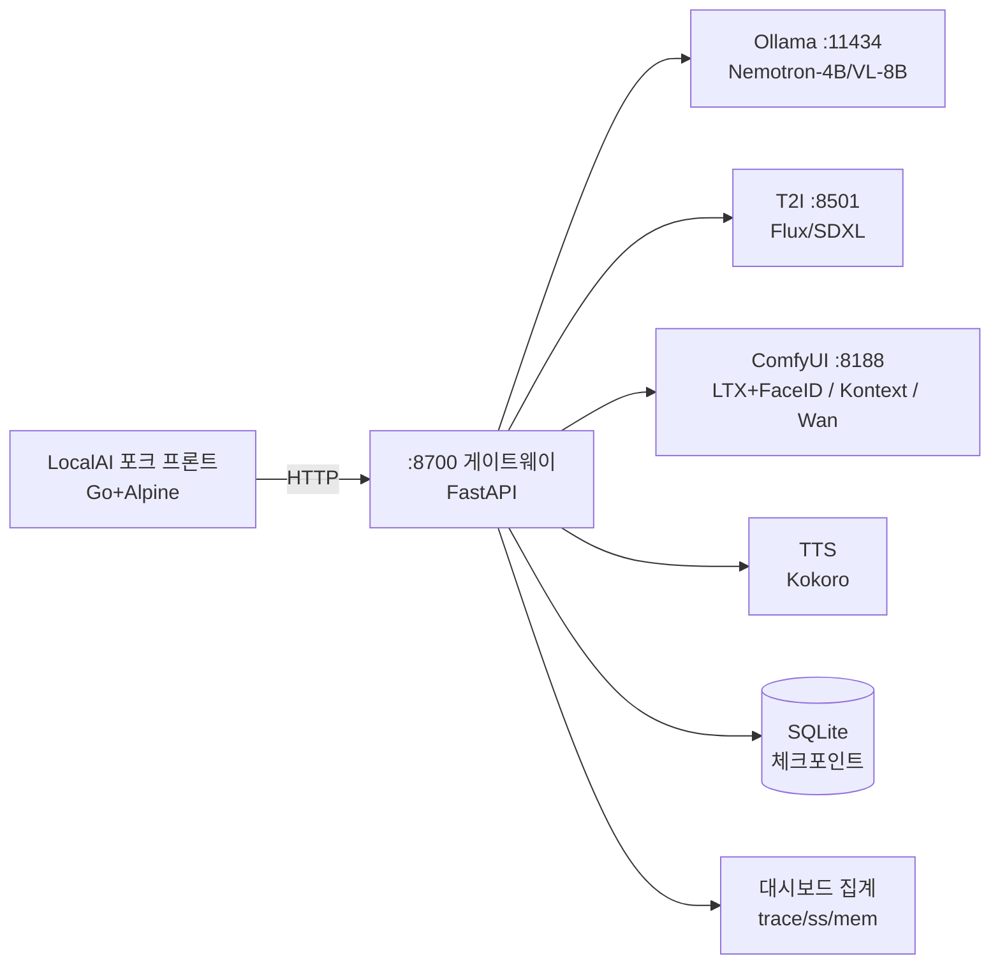
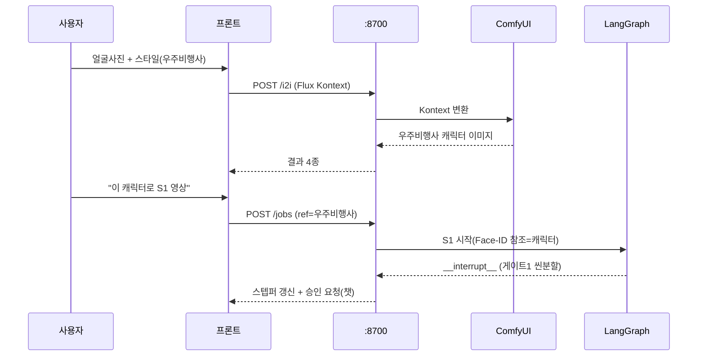
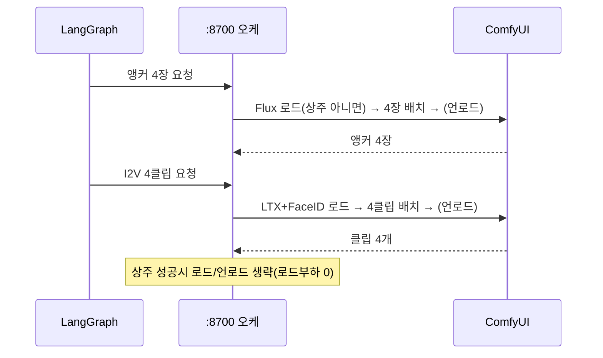

# Architecture — 오픈셸 자립형 생성 스튜디오

작성일: 2026-07-28
기준 문서: docs/PRD.md

## 기술 스택

| 레이어 | 선택 | 근거 |
|--------|------|------|
| UI 프론트 | LocalAI 포크 (Go 템플릿 + Alpine.js) | 룩앤필·카테고리 기본 제공, 껍데기만 재활용 |
| 게이트웨이 | :8700 FastAPI (기존 LangGraph API 확장) | 라우팅·OOM 오케·대시보드 집계 단일 총괄자 |
| 에이전트 | LangGraph + SQLite 체크포인터 | 승인 3게이트(interrupt), thread_id=job_id 재개 |
| LLM 서빙 | Ollama (:11434) | Nemotron-4B/VL-8B GGUF, keep_alive 제어 |
| 이미지 | Flux.1/SDXL(:8501) · Flux Kontext(ComfyUI :8188) | T2I 앵커 / I2I 얼굴변환 |
| 영상 | ComfyUI(:8188): LTX distilled+Face-ID / Cosmos벤치 / Wan폴백 | 캐릭터+화풍 일관 I2V |
| TTS | Kokoro 서버 | 82M 경량, 한국어, OOM 무관 |
| 저장 | SQLite(체크포인트) · 파일시스템(mp4/이미지) | 단일 사용자, 로컬 전용 |
| 배포 | systemd user units | 기존 관례(wan/comfyui/anim-agent), 격리·재기동 |

## 컴포넌트 경계

| 컴포넌트 | 책임 (한 줄) | 의존 대상 |
|----------|-------------|----------|
| LocalAI 포크 프론트 | 카테고리·스타일 셀렉터·노드 스텝퍼·대시보드 렌더, :8700만 호출 | :8700 |
| :8700 게이트웨이 | 요청 라우팅 + OOM 배치 오케 + 대시보드 메타 집계 + 승인 게이트 중계 | 전 백엔드 |
| LangGraph 에이전트 | S1 파이프 상태머신, 승인 3게이트, 재개 | Ollama·:8501·:8188·TTS·SQLite |
| Ollama | 씬분할(텍스트)·캡션(비전) | 모델 GGUF |
| T2I(:8501) | 앵커/단발 이미지 | Flux/SDXL 가중치 |
| ComfyUI(:8188) | I2V(캐릭터 일관) + I2I(Flux Kontext) | LTX+Face-ID LoRA·BFS노드·Wan(폴백) |
| TTS | 나레이션 wav 생성 | Kokoro |
| 대시보드 집계 | 실행트레이스·External calls(ss)·메모리게이지 | ss·ollama-serve.log·프로세스 VRAM |

## 데이터 흐름

### S2 → S1 연결 (얼굴 → 캐릭터 → 영상)

### S1 배치 생성 (OOM 상주/언로드)

## 비기능 요구

- **오프라인 자립**: 모든 백엔드 127.0.0.1, External outbound = 0 (ss 실측). 외부 API·CDN 의존 0
- **OOM**: GB10 119GB 통합메모리. 전 모델 상주(~55-60GB) 실측 게이트 → 실패시 배치 언로드. 데모중 OOM 0건
- **국적**: 전 모델 비중국/NVIDIA(Wan 폴백 예외). 신규 도입시 국적·라이센스 확인
- **재개성**: SQLite 체크포인트(thread_id=job_id) — 승인 지연/세션 종료 후 재개
- **격리**: systemd user units, 서비스별 독립 기동/로그
- **폴백 생존**: 각 레이어 폴백 사다리(PRD) + 시나리오 사전 녹화본
