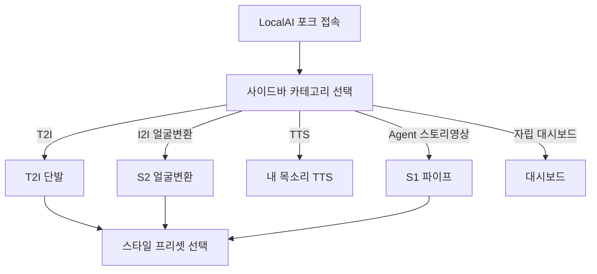
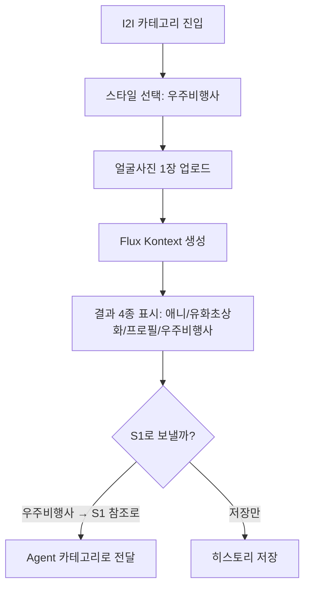
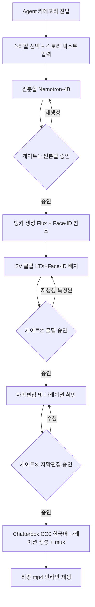
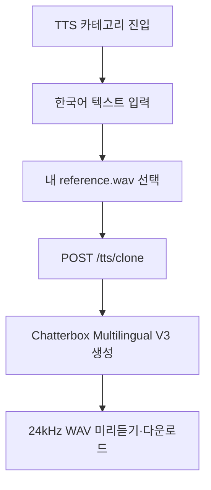
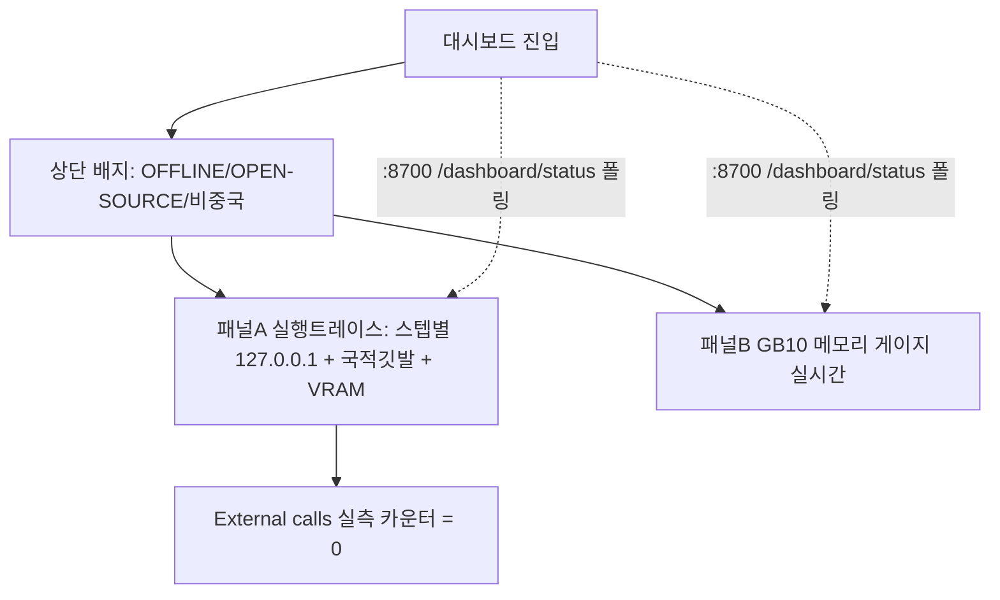

# User Flow — 오픈셸 자립형 생성 스튜디오

작성일: 2026-07-28
기준 문서: docs/PRD.md

## 핵심 플로우

> PRD Goals 기준. 공통 진입 = 카테고리 선택 → 스타일 선택 → 입력 → 생성.

### 플로우 0 — 공통 진입

### 플로우 1 — S2 얼굴변환 → S1 연결 (해피 패스)

**엣지 케이스**
- 얼굴 미검출/저해상도 → 재업로드 안내
- Flux Kontext 로드 지연(상주 실패시) → 스텝퍼에 "모델 로딩" 표시, 녹화본 백업

### 플로우 2 — S1 스토리 영상 (해피 패스, 승인 3게이트)

**엣지 케이스**
- Face-ID 일관성 미달(Day2 게이트 실패) → base LTX 무드형 폴백 경로
- OOM 발생 → 배치 언로드 모드로 자동 전환(게이트웨이 총괄)
- 승인 없이 세션 종료 → SQLite 체크포인트(thread_id=job_id)로 나중 재개
- 나레이션 > 클립 길이 → 마지막 프레임 홀드로 흡수(경량 mux)

### 플로우 3 — 독립 사용자 음성 TTS

**엣지 케이스**
- 참조 WAV 없음/손상/3초 미만 → 생성하지 않고 재업로드 안내
- GPU 또는 Chatterbox 로딩 실패 → 다른 화자로 바꾸지 않고 오류 표시
- 참조 음성은 사용자 소유 또는 사용 허가가 확인된 파일만 사용

### 플로우 4 — 자립 대시보드 (오프라인 증명)

**엣지 케이스**
- External calls > 0 감지 → 붉은 경고(어떤 프로세스가 외부로 나갔는지)
- 메모리 임계 근접 → 게이지 경고색 + 언로드 유도

## 화면/상태 목록

| 화면·상태 | 진입 조건 | 이탈 경로 |
|-----------|----------|----------|
| 카테고리 홈 | 접속 | 각 카테고리 |
| T2I 단발 | T2I 선택 | 히스토리/재생성 |
| S2 얼굴변환 | I2I 선택 | S1 전달 / 저장 |
| S1 Agent(스텝퍼) | Agent 선택 | 게이트1/2/3 → 최종 mp4 |
| 승인 게이트(챗) | 각 phase 완료 | 승인→다음 / 재생성→이전 |
| 내 목소리 TTS | TTS 선택 | 참조 WAV + 텍스트 → Chatterbox 결과 청취/다운로드 |
| 자립 대시보드 | 대시보드 선택 | (상시 폴링) |
