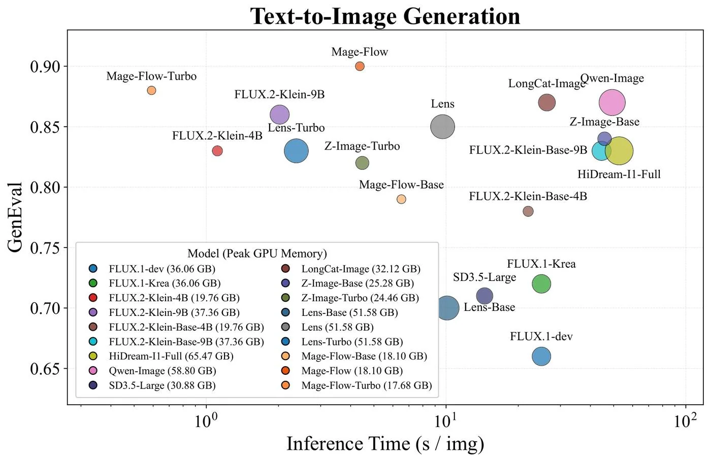

# 모델 선택 정리 (2026-07-30 기준)

목적: GB10(Grace-Blackwell, 119GB unified memory, 단일 워크스테이션) 위에서
돌아갈 파이프라인 모델 스택을 확정하기 위한 파라미터/GPU메모리/peak 메모리
비교 자료. 확정분은 실측(2.1~2.4), 미확정분은 웹 리서치(2026-07-30, HF
모델카드·공식 발표 기준) — **실측 아님, 출처 링크 확인 필수**.

## 선택 조건 (요구사항)

- **최우선**: 기존 LangGraph 아키텍처(`video_generator/langgraph`)에 맞아야
  함, 코드 수정 최소. 퀄리티도 필요.
- **Peak GPU 메모리**가 특히 중요 — "로드시" 아니라 "생성 중 peak"이 진짜
  제약(2.4에서 실증: baseline+3모델 합이 로드 직후엔 82Gi였다가 FLUX 생성
  중 118Gi까지 감).
- FA-4(Blackwell 가속) 쓰고 싶은데 성능 트레이드오프 우려.
- 비중국 경량 모델 선호.
- **선택 우선순위**: ① nvidia 자체 모델(Cosmos, Nemotron류) → ② 비중국
  모델 → ③ nvidia 공식지원(중국 원산 포함, 예: Qwen 계열 NVIDIA 리패키지).
- ComfyUI 워크플로우는 HuggingFace에서 이미 나온 것(얼굴유지 I2V, 테마별
  I2I 등) 빠르게 가져다 붙이는 걸 선호. 사용자 참고 링크: Krea 계열
  (`https://huggingface.co/buckets/hanna3203/Krea-2-bucket`).
- 전반적 관찰: 로봇·의료 특화 모델은 많은데, 일반 사용자용 12B 이하
  경량 멀티모달은 선택지가 적음(특히 T2I/I2V 대비 멀티모달 LLM 쪽).

---

## 확정된 모델 (2.1~2.4 게이트 통과, 실측)

| 역할 | 모델 | 국적 | 파라미터 | 디스크/양자화 | GPU 메모리(상주) | Peak GPU 메모리 | 근거 |
|---|---|---|---|---|---|---|---|
| 씬분할(텍스트) | Nemotron-3-Nano-4B-GGUF | 🇺🇸 NVIDIA | 3.97B | Q4_K_M, 2.8GB | 8.2GB (nvidia-smi 실측, context 262144 KV캐시 포함) | 단일요청 기준 로드=peak, 별도 스트레스 안 함 | [2.3 spike](spikes/2.3-scene-split-korean.md) |
| 비전 캡션 | gemma4:latest | 🇺🇸 Google | 8.0B(effective ~4B, 멀티모달 인코더 포함) | Q4_K_M(Google QAT), 9.6GB | 7.3GB (nvidia-smi 실측, context 131072) | 위와 동일 | [2.2 spike](spikes/2.2-vl-caption-models.md) |
| T2I 앵커 | FLUX.1-schnell | 🇩🇪 Black Forest Labs | 12B (DiT) | bf16 | — (단독 로드시 SDXL 9.0GB보다 무거움) | **33.8GB** (torch.cuda.max_memory_allocated 실측, 1024×1024·4step) | [.harness/STATE.md](../.harness/STATE.md) Task 2.3.5 |
| (프론트) | LocalAI 포크 | — | — | — | GPU 미사용(추론 백엔드 미탑재 껍데기) | — | [.harness/STATE.md](../.harness/STATE.md) Task 2.1 |

**동시상주 실측(2.4)**: 위 3개 + baseline(ComfyUI·Wan animate·무관 daol-fascope
등 이미 상주 중이던 서비스 36.4GB) 합산 시 시스템 메모리 82Gi→**118Gi/119Gi**
까지 상승, 스왑 15Gi 완전 소진, 압박 중 `video_generator/hunyuan_server/
server.py`(GPU 21.9GB 보유) 다운. → **전 모델 상주 기각, 폴백(배치 온디맨드
언로드) 채택**. 상세: [2.4 spike](spikes/2.4-oom-residency.md).

---

## 결정 대기 모델

> 아래 표는 **2026-07-30 웹 리서치 기준**(HF 모델카드·공식 리포 확인), GB10
> 실측 아님. "미확인"은 출처에서 못 찾은 값 — 추정치로 채우지 않음. Peak과
> Load를 분리해서 보고한 소스가 드물어 Peak이 전반적으로 가장 약한 데이터.

### I2I (현재 PRD 픽: FLUX.1 Kontext)

| 모델 | 국적 | 파라미터 | 디스크/양자화 | Load VRAM | Peak VRAM | 비고 |
|---|---|---|---|---|---|---|
| **FLUX.1 Kontext [dev]** | 🇩🇪 Black Forest Labs | 12B | bf16 23.8GB / fp8 커뮤니티양자 ~11.9GB / GGUF Q4 ~7GB | ~24GB(bf16) / ~12GB(fp8) / ~7GB(Q4) | ~31.5GB(bf16, offload 없음, RTX5090 기준) / ~20GB(fp8+offload) | 2025-06 출시, 비상업 라이선스, ComfyUI/diffusers/GGUF 다 됨 |

### I2V — 얼굴 일관성 4씬 유지가 핵심 요구

| 모델 | 국적 | 파라미터 | 디스크/양자화 | Load VRAM | Peak VRAM | 비고 |
|---|---|---|---|---|---|---|
| LTX-Video (distilled, 구버전) | 🇮🇱 Lightricks | 13B(경량 2B 변형도 있음) | bf16 28.6GB / fp8 15.7GB | 최소 6GB(offload+512×512, 정확한 clean-load 미확인) | 미확인(커뮤니티 보고 6~32GB, offload/해상도 의존) | ❌ **3.1에서 폐기 확정** — Face-ID LoRA 비호환(LTX-2.3 전용), LTX-2/2.3에 자리 내줌 |
| LTX "Best-Face-ID" LoRA | 커뮤니티(Alissonerdx), Lightricks 공식 아님 | 애드온 | LoRA 2.47GB(+ArcFace projector 69.3MB, CharacterSheet LoRA 1.31GB는 선택적, 3.1에서 스킵) | — | — | ✅ **3.1에서 확정 채택**: LTX-2.3(22B)용, `ComfyUI-BFSNodes`(=BFS노드) 필요. LTX-Video 13B distilled 비호환 확인됨(3.1 재확인 완료) — 상세: [3.1 spike](spikes/3.1-ltx-faceid-compat.md) |
| LTX-2.3-22B-dev (GGUF Q6_K, 경량) | 🇮🇱 Lightricks(원본) / unsloth(GGUF 양자화) | 22B | GGUF Q6_K **17.8GB**(공식 bf16 46.1GB 대비 약 61% 축소) | 실측 예정(3.2) | 실측 예정(3.2) | ✅ **3.1에서 채택**: Face-ID LoRA 호환 확인 스택의 실제 체크포인트. 공식 dev/distilled bf16(둘 다 46.1GB, fp8/GGUF 없음)보다 이 커뮤니티 GGUF가 유일한 경량 경로 — distill LoRA(rank-111 dynamic, `Kijai/LTX2.3_comfy`, 2.74GB, 공식 distilled-lora-384 7.61GB 대비 약 64% 축소)와 함께 8-step 거동 재현 |
| nvidia/Cosmos-Predict2-2B-Video2World | 🇺🇸 NVIDIA | 2B | bf16 `.pt`, 3.91GB(해상도/fps별) | Load/Peak 분리 안 됨 | 32.54GB(공식수치, 720p/16fps, no sparsity) | 공식 NVIDIA 리포, Cosmos-Predict2.5가 후속작으로 이미 나옴 |
| Wan2.1-T2V-14B(Stand-In 베이스) | 🇨🇳 Alibaba | 14B | ~57GB(6샤드) + VAE 508MB + T5인코더 11.4GB | 40~48GB(480p, fp8+offload) | 65~80GB(720p, 단일GPU) | ⚠️ **현재 이 repo에 실제 배선된 건 `Wan2.2-Animate-14B-Diffusers`**(animate_server.py) — PRD가 적은 "Wan2.1-14B"와 버전 드리프트 있음, PRD 정정 필요 |
| Stand-In(애드온) | 🇨🇳 WeChatCV(Tencent 계열 추정, 사명 100%확인은 아님) | 153M(베이스의 ~1%) | 미확인 | — | — | CVPR2026 accepted, Wan2.1-T2V-14B 호환 |
| **LTX-2 / LTX-2.3** | 🇮🇱 Lightricks | LTX-2: 19B(비디오14B+오디오5B) / **LTX-2.3(현재판, 2026-03): 22B** | fp8 distilled 27GB(19B)/29.5GB(22B), bf16 43GB(19B) | fp8 distilled 16GB로 구동(~768p 상한) | ~24GB "쾌적" 1024p(커뮤니티, 공식수치 아님) | ✅ 실존 확인, 2026-01 오픈소스, 오디오 동기화+4K/50fps 추가. Face-ID LoRA는 이 버전 대상 |
| stable-video-diffusion-img2vid | 🇺🇸 Stability AI | SVD 2B / SVD-XT 2B(25프레임) | 미확인 | 미확인 | 미확인(A100-80GB 기준 생성시간만 있음) | ⚠️ **사실상 레거시** — 호스팅 API 2025-07-24 중단, 커뮤니티는 Wan/HunyuanVideo-I2V/LTX-2로 이동함 |
| (참고) NVIDIA Cosmos 수술/의료 특화 | 🇺🇸 NVIDIA | — | — | — | — | Cosmos-H-Surgical/Dreams 등 실존하나 da Vinci 로봇 kinematics 특화 — **일반 애니메이션 용도 아님** |

### T2I 대안 (확정: FLUX.1-schnell)

> 사용자 제공 벤치마크 차트(출처 논문/포스트 미확인 — "Mage-Flow: An Efficient
> Native-Resolution Foundation Model" 관련으로 추정). x축 추론시간, y축
> GenEval, 버블 크기=Peak GPU Memory. 차트 범례에서 그대로 뽑은 Peak GPU
> Memory 수치:

| 모델 | Peak GPU Memory(차트) | GenEval | 비고 |
|---|---|---|---|
| Mage-Flow-Turbo | 17.68 GB | 0.88 | 이 차트 기준 최경량, 가장 빠름(~0.6s) |
| Mage-Flow | 18.10 GB | **0.90**(차트 내 최고) | 가벼우면서 품질도 1위 — **가중치 공개여부·라이선스·ComfyUI 지원 미확인, 검증 필요** |
| Mage-Flow-Base | 18.10 GB | 0.79 | |
| FLUX.2-Klein-4B | 19.76 GB | 0.83 | |
| FLUX.2-Klein-Base-4B | 19.76 GB | 0.78 | |
| Z-Image-Turbo | 24.46 GB | 0.82 | |
| Z-Image-Base | 25.28 GB | 0.84 | |
| SD3.5-Large | 30.88 GB | 0.70 | |
| LongCat-Image | 32.12 GB | 0.87 | |
| FLUX.2-Klein-9B | 37.36 GB | 0.86 | |
| FLUX.2-Klein-Base-9B | 37.36 GB | 0.83 | |
| FLUX.1-dev / FLUX.1-Krea | 36.06 GB | 0.65 / 0.72 | 위 리서치 표의 FLUX.1-dev 수치(bf16 load ~24GB)와 다름 — 이 차트는 offload 없는 풀로드+생성 peak로 추정, 소스 다름 주의 |
| Lens / Lens-Turbo / Lens-Base | 51.58 GB | 0.85 / 0.83 / 0.70 | |
| Qwen-Image | 58.80 GB | 0.87 | 2.3.5에서 기각한 `Qwen-Image-Flash`와 동일 계열(distill 버전) |
| HiDream-I1-Full | 65.47 GB | 0.83 | 이 차트 기준 최중량 |

**Mage-Flow가 가장 눈에 띔**(최저 peak+최고 GenEval) — 실제 채택 검토하려면
가중치 공개 여부·라이선스·ComfyUI/diffusers 지원·국적(원산 조직) 먼저 확인
필요, 이번 리서치 범위에는 없었음.

| 모델 | 국적 | 파라미터 | 디스크/양자화 | Load VRAM | Peak VRAM | 비고 |
|---|---|---|---|---|---|---|
| FLUX.1-dev | 🇩🇪 Black Forest Labs | 12B | bf16 23.8GB / fp8 ~11.9GB / GGUF Q4 6~8GB | ~21.5~24GB(bf16) | 미확인(~26GB 언급되나 load/peak 미분리) | 비상업 라이선스 |
| Krea-2-Turbo (`krea/Krea-2-Turbo`) | 🇺🇸 Krea AI(샌프란시스코) | 12B(카드) / 13B(제품뱃지) — 소스 간 불일치 | bf16 ~24.5GB / fp8·NVFP4 ~10~12GB / INT4 ~7GB | ~16GB(bf16 최소, 다른 소스는 ~28GB fp16) | ~28GB(언급되나 load/peak 미분리) | ✅ 실존 확인(gated, Krea 2 Community License), 2026-06 출시, 8-step distilled |
| nvidia/ideogram-4-fp8 (`ideogram-ai/ideogram-4-fp8`) | 🇨🇦 Ideogram(토론토) — **단 텍스트인코더가 Qwen3-VL-8B-Instruct(🇨🇳 Alibaba 원산)** | DiT 9.3B + 텍스트인코더 8B ≈ 파이프라인 총 17B | DiT만 fp8 9.29GB, 전체 파이프라인 크기 미확인 | 16GB(fp8 단일이미지 최소, 인용치) | 미확인("32GB+ 쾌적" 인용, load/peak 미분리) | ✅ 실존 확인(gated, 비상업), 2026-06 출시. **비중국 정책상 텍스트인코더 원산 체크 필요** |
| nvidia/Qwen-Image-Flash (이미 기각) | 파이프라인 자체 🇺🇸 NVIDIA 배포, **원본 가중치 🇨🇳 Alibaba/Qwen** | Denoising transformer 20.43B / 파이프라인 총 28.85B | 리포 총 bf16 57.7GB | — | OOM(2.3.5에서 GB10 실측 기각, ComfyUI+anim-agent 상주 기준) | 2026-07-23 출시, 4-step DMD2는 **스텝만 줄이지 메모리는 안 줄인다고 카드에 명시** |

### LLM·멀티모달 대안 (확정: Nemotron-3-Nano-4B 텍스트 + gemma4 비전)

| 모델 | 실제 원산 | 파라미터 | 디스크/양자화 | Load VRAM | Peak VRAM | 비고 |
|---|---|---|---|---|---|---|
| nvidia/Nemotron-3-Nano-30B-A3B (정식명, "Nemotron-Nano-30B" 아님) | 🇺🇸 NVIDIA(자체 학습, 리패키지 아님) | 30B total / 활성 ~3.5B, MoE+Mamba2 하이브리드 | NVFP4, 5샤드, **19.4GB** | 미확인(단일 clean-load 수치 없음) | 50~120GB(DGX Spark/GB10, vLLM, 설정 의존) | 2026-01-28 출시. **베이스는 텍스트전용** — 멀티모달은 별도 리포 `Nemotron-3-Nano-Omni-30B-A3B-Reasoning`(텍스트+이미지+영상+오디오) |
| nvidia/Qwen3.6-35B-A3B-NVFP4 | **🇨🇳 Alibaba**(NVIDIA는 양자화만) | 35B total/활성3B MoE, 256K ctx | NVFP4, **23.5GB** | ~22GB(커뮤니티) | 미확인(GB10 80tok/s만 보고, peak 없음) | ✅ 실존 확인(2026-05-28 출시) |
| nvidia/Gemma-4-26B-A4B-NVFP4 | 🇺🇸 Google DeepMind | 25.2B total/활성3.8B MoE, 내장 비전인코더 ~550M | NVFP4, **18.8GB** | **16.5GB**(GB10/DGX Spark 실측) | 벤치상 ~100GB 예산 중 82GB를 KV캐시로 남김(단일수치 아님) | ✅ 실존 확인(2026-04-30 출시, Gemma 4가 실제로 있음). vLLM은 아직 TP=1만 지원(오픈 이슈) |
| nvidia/diffusiongemma-26B-A4B-it-NVFP4 | 🇺🇸 Google DeepMind | Gemma-4-26B-A4B와 동일 백본, diffusion 방식 생성 | NVFP4, **18.9GB** | ~18GB(구글 자체 수치, GB10 아님) | 미확인 | ✅ 실존, 2026-06-10 출시(가장 최신·미성숙). vLLM 통합 "잠정적" 표기 |
| (현재 픽 상세) gemma4:latest / gemma4:e4b | 🇺🇸 Google | "effective 4B"(raw 8B, 임베딩 포함) | Google QAT, **9.6GB 정확히 일치** | 미확인 | 미확인 | Gemma 4(2026-04-02 출시, Apache-2.0) 진짜 맞음 — gemma3:4b(3.3GB)/12b(8.1GB)/27b(17GB) 어느 것과도 안 맞아서 Gemma3 오표기 아님 확인됨 |
| Llama 비전(참고) | 🇺🇸 Meta | Llama4 Scout/Maverick, MoE 네이티브 멀티모달 | 미확인 | 미확인 | 미확인 | Llama4가 옛 mllama 방식(2.2에서 ollama 미지원으로 기각됐던 그 아키텍처) 대체함 — 재시도해볼 여지 있으나 미검증 |

### TTS 대안 (확정: Kokoro 82M, 나머지는 샘플 A/B 벤치용)

| 모델 | 국적 | 파라미터 | 디스크/양자화 | Load VRAM | Peak VRAM | 비고 |
|---|---|---|---|---|---|---|
| Kokoro-82M | 🇺🇸 hexgrad(개인) | 82M | fp32/bf16 ≈326MB, JS q4 양자화 86MB까지 | <1~2GB(커뮤니티 비공식) | 미확인 | 2025-01 v1.0, Apache-2.0, CPU 구동 가능 |
| Zonos-v0.1 | 🇺🇸 Zyphra(Palo Alto) | 1.6B(HF 요약본은 2B라 하나 파일크기상 1.6B가 맞음) | bf16 3.25GB | 공식 최소 6GB+(RTX3000번대~) | 미확인(RTX4090 기준 ~2x realtime만 보고) | v0.1 베타, Apache-2.0, 공식 Linux전용 |
| CosyVoice2-0.5B | 🇨🇳 FunAudioLLM(Alibaba Tongyi Speech Lab) | 0.5B | 미확인(Q4_K_M <1GB 보고) | 전정밀도 권장 ~4GB, Q4 <1GB, CPU 구동 가능 | 미확인 | 스트리밍 ~150ms 지연, CosyVoice3 후속작 이미 발표 |
| Metis | 🇨🇳 CUHK-Shenzhen(Amphion 프로젝트) | 학습파라미터 <20M(논문 자체 수치) | 전용 safetensors 미공개(MaskGCT 체크포인트 재사용) | 미확인 | 미확인 | 연구 논문/툴킷 수준, 프로덕션급 배포 사례 없음 — 나머지 3개 대비 성숙도 낮음 |

---

## 시사점

1. **(해결됨, 2026-07-30) 3.1 검증 완료**: 리서치대로 Face-ID LoRA는
   LTX-Video 13B distilled 비호환, **LTX-2.3(22B) 전용**으로 확인됨. 3.1을
   "LTX-2.3-22B-dev(GGUF Q6_K) + distill LoRA + Face-ID LoRA + BFS Nodes"로
   재정의·설치·워크플로 로드 검증 완료. 상세: [3.1 spike](spikes/3.1-ltx-faceid-compat.md).
2. **비중국 정책 재점검 대상**: Wan(Alibaba), CosyVoice2/FunAudioLLM
   (Alibaba), Metis(CUHK-Shenzhen), Qwen3.6-NVFP4(원본 Alibaba),
   ideogram-4-fp8(텍스트인코더가 Qwen3-VL, Alibaba) — "nvidia 공식지원"
   카테고리는 원산지 라벨과 실제 학습 주체가 분리돼있다는 점 문서화 필요.
3. **PRD 버전 드리프트 2건**: (a) I2V 폴백 "Wan2.1-14B"가 실제 배선은
   Wan2.2-Animate-14B, (b) T2I/멀티모달 후보군에 Gemma 4·LTX-2.3처럼
   PRD 작성 이후 새로 나온 옵션들이 있음 — PRD/Architecture 갱신 검토.
4. **Peak VRAM 데이터가 전반적으로 약함**: 대부분의 공개 소스가 load만
   보고하고 peak(생성 중 순간 최대)은 안 나눔. GB10 자체 실측(2.3.5·2.4
   방식)이 최종 결정 전 가장 신뢰할 수 있는 근거 — 특히 I2V 후보 3~4개로
   좁혀지면 bench_t2i.py류 스크립트로 직접 재측정 권장.
5. **Krea-2-Turbo·ideogram-4-fp8·LTX-2.3·Gemma-4 계열 모두 실재 확인됨**
   (사용자가 최근 나온 모델이라 확인이 필요하다고 짚은 후보들 — 전부 진짜
   존재, 허구 아님).
