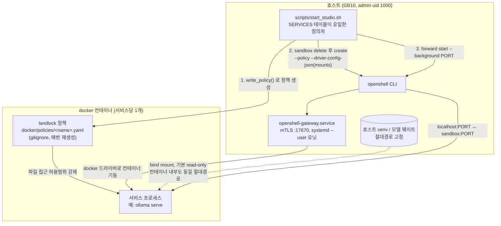
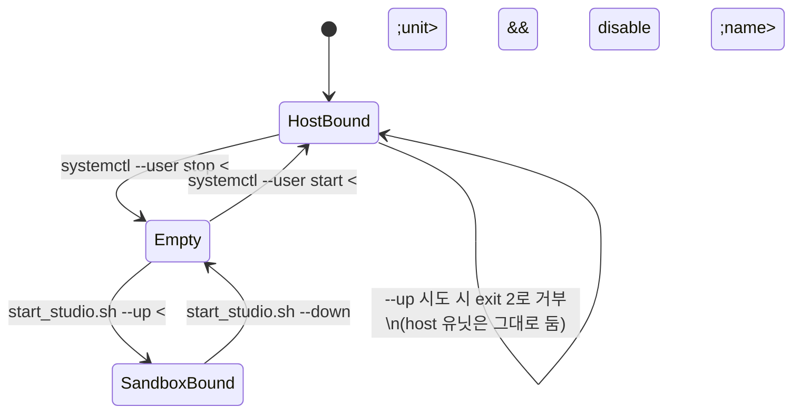
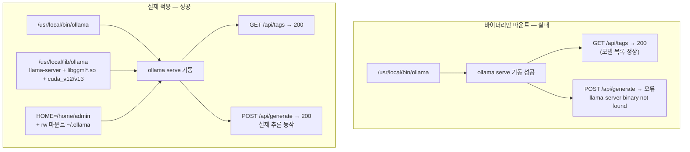

# OpenShell 샌드박스 격리 — 구조와 동작 원리

작성일: 2026-08-07
기준 파일: `scripts/start_studio.sh`, `docker/Dockerfile.runtime`, `~/.config/openshell/gateway.toml`, `docker/policies/*.yaml`(런타임 생성물)

Task 8.2.1에서 도입한 선택적 격리 경로다. 기본은 여전히 host systemd 유닛(README "기동" 절)이고, 이 문서가 다루는 것은 그 대안인 openshell GPU 샌드박스 경로 — ComfyUI/T2I/Kokoro/Chatterbox/Ollama 5종을 host 대신 격리된 컨테이너에서 띄우는 방법이다.

## 1. 드라이버 선택 — docker, k3s 아님

OpenShell 자체는 드라이버를 플러그인처럼 갈아끼울 수 있는 구조지만, 이 저장소가 쓰는 게이트웨이 설정(`~/.config/openshell/gateway.toml`)에는 `[openshell.drivers.docker]`만 있다. 즉 여기서 "샌드박스 하나"는 곧 "docker 컨테이너 하나"다. k3s/Kubernetes 드라이버 설정은 존재하지 않으므로 NetworkPolicy나 PodSecurityPolicy 같은 클러스터 수준 개념은 애초에 적용 대상이 아니다. 격리는 컨테이너 경계 + 아래 3절에서 다루는 landlock 파일시스템 정책, 이 두 겹으로만 이루어진다.

## 2. 전체 기동 경로



`scripts/start_studio.sh`의 `SERVICES` 히어독(이름·포트·GPU 여부·workdir·실행 커맨드·env·마운트 목록, 서비스당 한 줄)이 유일한 정의처다. `docker/policies/*.yaml`은 `write_policy()` 함수가 `--up` 실행마다 그 정의를 바탕으로 새로 찍어내는 산출물이라 `.gitignore`에 걸려 있고, 저장소에는 커밋되지 않는다. 설정을 바꿀 일이 있으면 정책 파일이 아니라 스크립트의 `SERVICES` 테이블을 고쳐야 한다.

살아있는 샌드박스에 정책만 좁히는 요청은 서버가 거부한다(`filesystem read_write path '/dev/null' cannot be removed on a live sandbox`). 그래서 `--up`마다 기존 샌드박스를 `sandbox delete`로 지우고 정책과 함께 새로 만든다 — 상태 드리프트가 쌓이는 걸 원천 차단하는 방식이다.

`docker/Dockerfile.runtime`은 의도적으로 얇다. `pip install`이 없다 — GB10(ARM64 + Blackwell sm_121)에서 torch 휠을 이미지 안에서 재현하는 비용이 크고, 서비스마다 torch 버전이 다르기 때문이다(ComfyUI/T2I 2.12.1, Chatterbox 2.11.0, Cosmos3Nano 2.13.0). 대신 apt로 공유 시스템 라이브러리(libgl1, libsndfile1, ffmpeg 등)만 설치하고, 실제 파이썬 패키지·모델 웨이트는 호스트 venv를 그대로 bind mount해서 쓴다.

## 3. 포트 배타 규칙 — host 유닛과 샌드박스는 같은 포트를 공유한다

같은 서비스가 host systemd 유닛으로도, openshell 샌드박스로도 뜰 수 있는데 두 경로가 쓰는 포트 번호는 동일하다(예: ollama는 어느 쪽이든 `:11434`). 포트는 한 시점에 하나의 프로세스만 점유할 수 있으므로 두 경로는 항상 배타적이고, 전환은 자동이 아니라 사람이 명시적으로 수행해야 한다. 스크립트는 "남의 프로세스를 죽이지 않는다"는 원칙을 지킨다 — host 유닛이 포트를 쥐고 있으면 `--up`은 무조건 실패시키고, 어떤 유닛을 내려야 하는지만 알려준다.



`--check`는 포트를 점유 중인 프로세스가 systemd 유닛이면 유닛 이름까지 짚어서 내려야 할 명령(`systemctl --user stop ... && disable`)을 그대로 출력한다. `--up`은 전제조건(마운트 원본 존재 등)과 포트 충돌을 둘 다 통과해야 진행되며, 포트가 막혀 있으면 exit code 2로 중단한다.

## 4. 마운트 규칙 — 절대경로 고정, 기본 read-only

### 4.1 왜 절대경로가 고정이어야 하는가

호스트 venv를 컨테이너에 마운트할 때는 컨테이너 내부에서도 **호스트와 동일한 절대경로**에 붙여야 한다. 이유는 venv 내부에 절대경로가 두 군데 박혀 있기 때문이다.

- **shebang**: venv의 `bin/pip`, `bin/accelerate` 같은 실행 스크립트는 첫 줄에 `#!/home/admin/huyuan-env/bin/python3`처럼 자신을 실행할 인터프리터의 절대경로가 적혀 있다. 이 파일이 마운트된 컨테이너 안에서 다른 경로에 있으면, 셸이 이 첫 줄을 그대로 믿고 그 경로를 찾다가 실패한다.
- **pyvenv.cfg**: venv 루트의 이 파일에는 `home = /usr/bin`, `executable = /usr/bin/python3.12`처럼 이 venv가 어떤 시스템 파이썬을 기반으로 만들어졌는지가 절대경로로 적혀 있다. venv의 `python3`를 실행하면 이 파일을 읽고 실제 인터프리터를 찾아가는데, 컨테이너 안에 그 경로의 파이썬이 없으면 체인이 끊긴다. (그래서 `Dockerfile.runtime`이 호스트와 동일한 Ubuntu 24.04 / Python 3.12.3 마이너 버전을 맞춰 깐다.)

두 파일 다 마운트 위치가 호스트와 어긋나는 순간 즉시 깨지므로, "동일 절대경로 마운트"는 최적화가 아니라 필수 조건이다.

### 4.2 read-only가 기본, rw는 실제로 쓰기가 필요한 곳만

| 서비스 | 포트 | GPU | rw 마운트(쓰기가 필요한 이유) |
|---|---|---|---|
| comfyui | 8188 | yes | `output/` `temp/` `user/` — 생성 결과물 저장 |
| t2i (Flux.1-schnell) | 8501 | yes | 없음 (전부 ro) |
| kokoro | 8503 | no | 없음 (전부 ro) |
| chatterbox | 8504 | yes | 없음 — 캐시는 `NUMBA_CACHE_DIR=/tmp`로 정책상 쓰기 가능한 `/tmp`에 우회 |
| ollama | 11434 | yes | `~/.ollama`(pull 시 blobs/manifests), `/usr/share/ollama/.ollama/models` |

rw로 여는 순간 그 마운트는 호스트 원본 그 자체를 가리키므로, 컨테이너가 호스트 웨이트를 실수로 덮어쓸 수 있다. 그래서 실제로 쓰기가 필요한 경로만 최소한으로 rw로 열고 나머지는 전부 읽기전용이다. 마운트 목록은 필요한 것만 골라 붙인다 — HF 캐시 전체(348GB)를 통째로 물리면 격리의 의미가 없어지므로 모델 디렉터리 단위로 끊는다.

읽기전용 venv가 런타임에 자기 site-packages에 캐시를 쓰려는 라이브러리를 깨뜨리는 경우도 있다(chatterbox의 librosa→numba 조합, 실측 오류: `cannot cache function '__o_fold': no locator available`). 이때 venv 자체를 rw로 열지 않고, 캐시 경로만 정책상 쓰기 가능한 `/tmp`로 돌려서 해결한다.

## 5. landlock 정책 — 파일시스템 접근 범위 강제

컨테이너 격리만으로는 "루트 프로세스가 마운트된 호스트 파일을 마음대로 읽고 쓴다"는 문제를 못 막는다. 그 위에 landlock(리눅스 커널 LSM) 정책을 얹어서 read_only/read_write 경로 목록을 명시적으로 강제한다. `/home`은 권한상 `755 root:root`라 컨테이너 유저가 읽을 수 있을 것 같지만, 정책에 등록하지 않으면 `ls /home`조차 `Permission denied`로 막힌다(실측). 그래서 마운트한 경로는 반드시 정책의 `read_only`/`read_write` 목록에도 동일하게 등록해야 한다. GPU 서비스는 `/sys`(CUDA 초기화가 디바이스 토폴로지를 읽음), `/dev/shm`·`/dev/nvidiactl`·`/dev/nvidia0`·`/dev/nvidia-uvm*`(torch 공유메모리·NVIDIA 디바이스 노드)가 추가로 필요하다.

## 6. ollama의 두 가지 함정

### 6.1 바이너리만 마운트하면 추론이 죽는다

`/usr/local/bin/ollama`는 34MB짜리 ELF 실행파일 하나다. 이것만 마운트하면 `ollama serve`는 뜨고 `GET /api/tags`(모델 목록)도 200을 정상 반환한다. 그런데 실제 텍스트 생성 요청을 넣으면 ollama가 내부적으로 별도 실행파일 `llama-server`를 호출하는데, 그 실행파일과 의존 라이브러리(`libggml*.so`, `cuda_v12/`, `cuda_v13/`)는 `/usr/local/bin`이 아니라 `/usr/local/lib/ollama/`에 따로 있다. 이 디렉터리를 같이 마운트하지 않으면 `POST /api/generate`가 `"llama-server binary not found"`로 실패한다 — 모델 목록만 보고 판정하면 절대 못 잡는 실패다.



### 6.2 `$HOME`이 정책상 못 쓰는 경로를 가리킨다

리눅스 프로그램은 흔히 설정·키를 `$HOME` 밑에 저장한다(`~/.ssh`, `~/.bashrc`처럼). ollama도 첫 기동 시 `$HOME/.ollama`에 인증키를 만들려고 한다. 그런데 컨테이너 안 로그인 유저는 `sandbox`이고 이 계정의 기본 `$HOME`은 `/home/sandbox`인데, 이 경로는 정책의 read_only/read_write 목록 어디에도 없다 — 아예 열려있지 않은 경로다. 그래서 ollama가 `mkdir /home/sandbox/.ollama: permission denied`로 죽는다.

해결은 "쓰기 권한이 있는 집 주소로 바꿔주는" 것이다. env에 `HOME=/home/admin`을 지정하고, 호스트의 `/home/admin/.ollama`를 rw로 마운트해서 그 경로에 실제로 쓸 수 있게 한다.

**판정 원칙**: 두 함정 다 `GET /api/tags`는 정상 응답을 준다. 따라서 ollama 샌드박스가 실제로 동작하는지 확인할 때는 반드시 `/api/generate`나 `/api/embeddings` 같은 실제 추론 호출로 검증해야 한다.

## 7. 운영 명령

```bash
./scripts/start_studio.sh --check          # 전제조건·포트 점유 점검, 아무것도 바꾸지 않음
./scripts/start_studio.sh --smoke          # 호스트 venv가 이미지 안에서 import되는지만 검증(서버 기동 없음)
./scripts/start_studio.sh --up             # 5종 전체 샌드박스 기동
./scripts/start_studio.sh --up chatterbox  # 서비스 하나만 전환 (실패 원인 격리를 위해 단계적 전환이 기본 사용법)
./scripts/start_studio.sh --down           # forward 해제 + 샌드박스 삭제
```

샌드박스 상태와 forward 연결 상태는 각각 다른 명령으로 확인한다 — 컨테이너가 `Ready`여도 forward가 `dead`면 localhost 포트로는 호출이 안 된다.

```bash
openshell sandbox list    # 컨테이너 자체가 떠 있는지 (Ready/CrashLoop 등)
openshell forward list    # localhost:PORT ↔ 샌드박스 포워딩이 붙어 있는지 (running/dead)
```

## 8. 참고 파일

- `scripts/start_studio.sh` — SERVICES 테이블, `write_policy()`, 포트 충돌 판정 전부 여기에 있다.
- `docker/Dockerfile.runtime` — 얇은 공유 런타임 이미지. pip install 없음, host venv를 마운트해서 쓴다.
- `~/.config/openshell/gateway.toml` / `gateway.env` — 드라이버 선택(docker), bind mount 허용(`enable_bind_mounts = true`).
- `docker/policies/*.yaml` — 런타임 생성물, git 추적 안 함(`.gitignore:30`).
